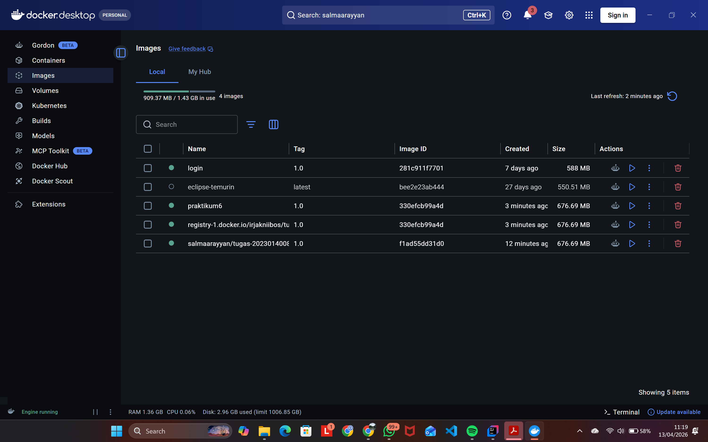
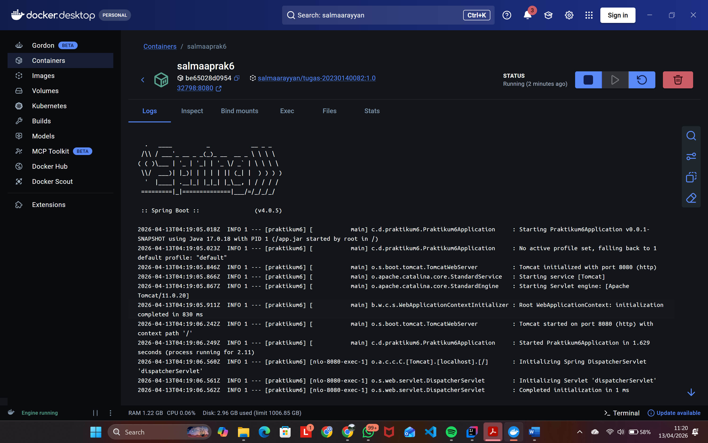
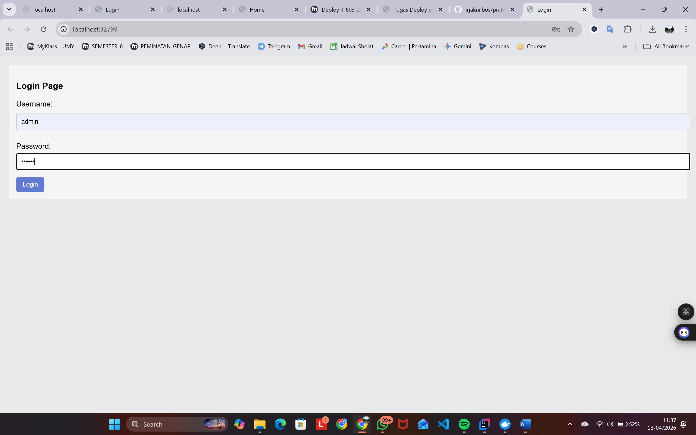
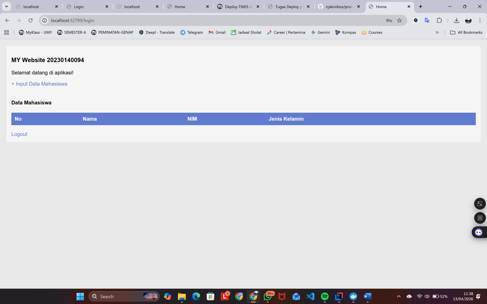
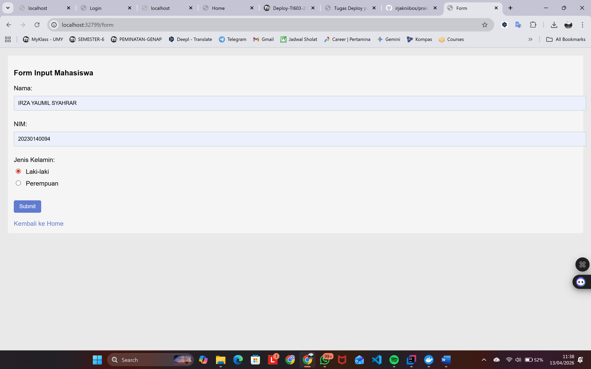
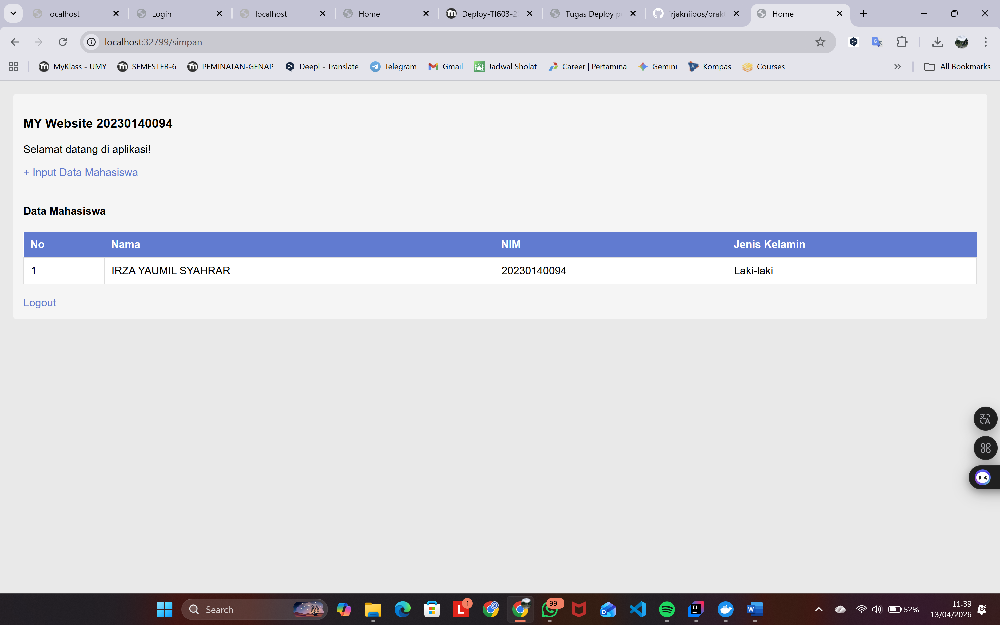
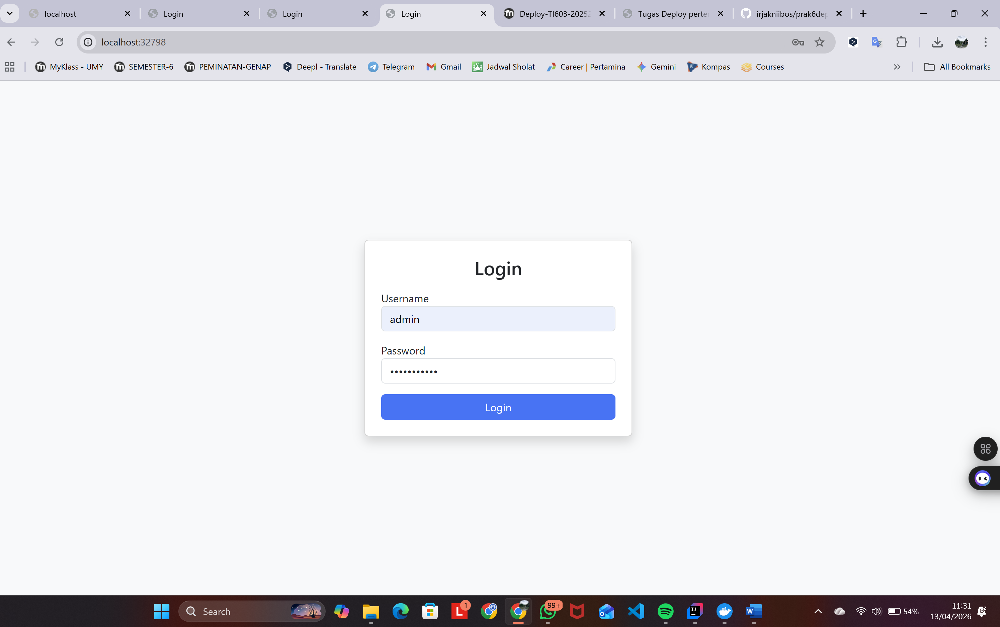
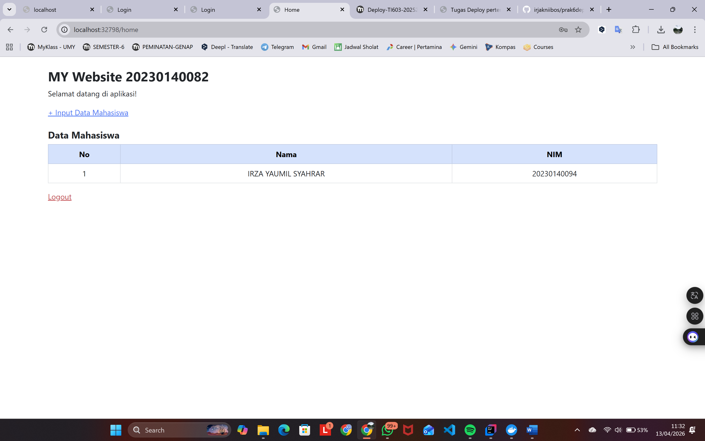
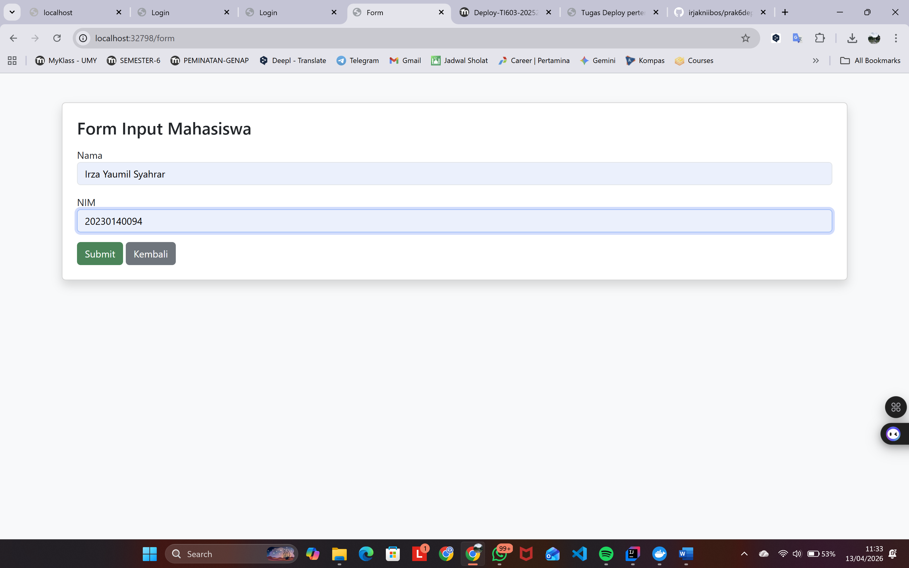

#Dokumentasi Tugas Deploy Pertemuan 6

##Identitas

* Nama: Irza Yaumil Syahrar
* NIM: 20230140094

---

# 🐳 1. Docker Image

Screenshot halaman **Images di Docker Desktop** setelah:

* build image sendiri
* pull image dari teman

📸

---

# 🐳 2. Docker Container

Screenshot halaman **Containers di Docker Desktop** setelah menjalankan container dari image teman

📸

---

# 🌐 3. Aplikasi Sendiri

## 🔐 Login

📸

---

## 🏠 Home

📸

---

## 📝 Form Input

📸

---

## 📊 Home Setelah Input

📸

---

# 🌐 4. Aplikasi Teman

## 🔐 Login

📸

---

## 🏠 Home

📸

---

## 📝 Form Input

📸

---

## 📊 Home Setelah Input

📸

---

# 📌 Catatan

* Aplikasi dijalankan menggunakan Docker
* Port yang digunakan: `8080`
* Image telah berhasil di-push ke Docker Hub
* Image teman berhasil di-pull dan dijalankan
---